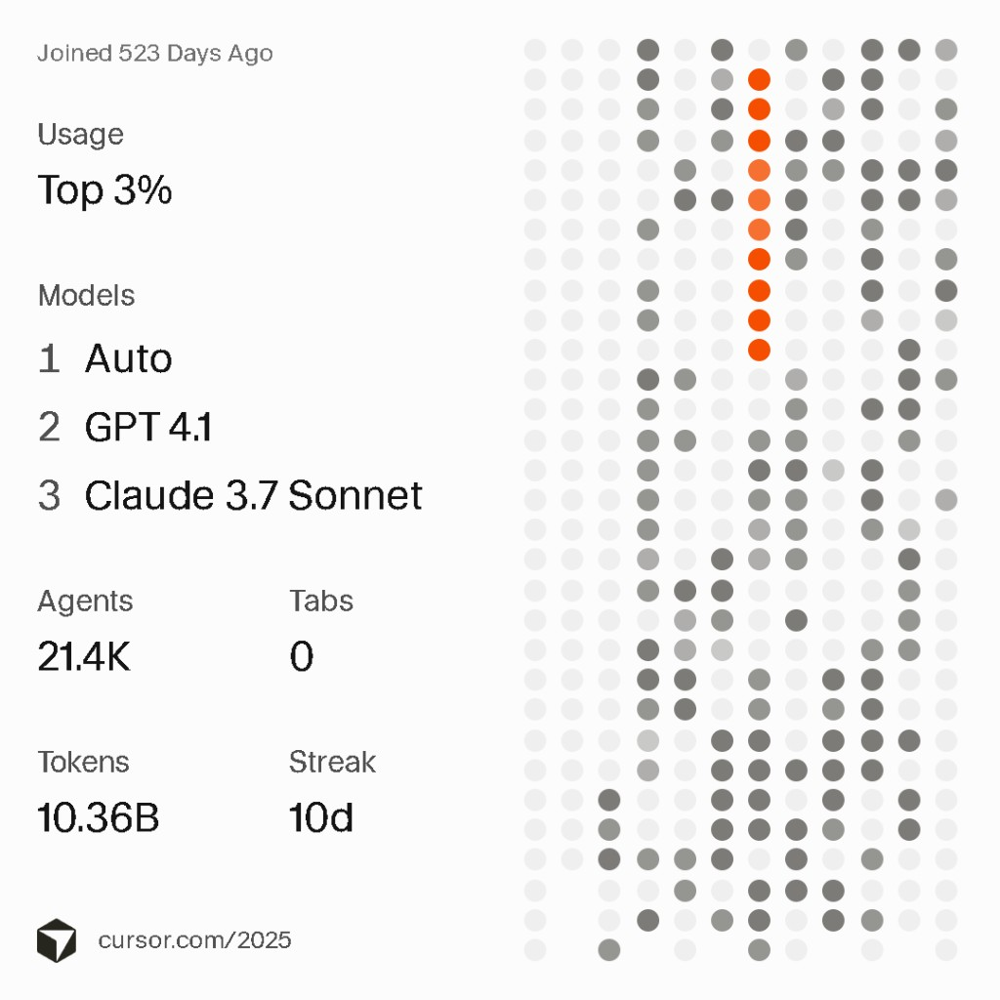

# Hi, I'm Alex Tarabanov ✌️

**Founder @ [VC HB3 Accelerator](https://github.com/VC-HB3-Accelerator)** · [hb3-accelerator.com](https://hb3-accelerator.com/)

## Digital Legal Entity (DLE)

[Digital Legal Entity (DLE)](https://github.com/VC-HB3-Accelerator/DLE) is an on-premise platform for business automation. Deployed on your company's servers — your data stays with you. Two technologies at the core of one product: **AI** and **EVM smart contracts**.

Instead of a patchwork of paid subscriptions and legacy services — one modern stack for operations, customers, payments, and governance.

**For clients**

- up to **90%** lower operating costs
- up to **90%** higher process efficiency
- **full data control** (on-premise, aligned with local regulatory requirements)
- **no dedicated IT department** — your staff run the system after short training

**Model**

- base core — **free**
- support, industry template customization, and training — **fixed price for 5 years**
- contract includes **70% refund** if we breach agreed terms
- we onboard **1–2 companies per industry vertical** (delivery quality)

**[Live demo: product walkthrough & use cases (30 min)](https://scheduler.zoom.us/vc-hb3-accelerator/30-mins-with-vc-hb3-accelerator)**

### License

DLE is distributed under a **proprietary license (EULA)** and is **not open source**.

Use, modification, and resale are governed by the [LICENSE](https://github.com/VC-HB3-Accelerator/DLE/blob/main/LICENSE) and a contract with the author or an [authorized contributor](https://github.com/VC-HB3-Accelerator/DLE/blob/main/legal.en/CONTRIBUTOR_LICENSE.md).

Copyright holder: [AUTHORS](https://github.com/VC-HB3-Accelerator/DLE/blob/main/legal.en/AUTHORS.md)

---

## Cursor Year in Code 2025

| Metric | Value |
|--------|-------|
| **Usage** | Top 3% |
| **Agents** | 21.4K |
| **Tokens** | 10.36B |
| **Streak** | 10d |
| **Top Models** | Auto · GPT 4.1 · Claude 3.7 Sonnet |

[Discussion on Cursor Forum](https://forum.cursor.com/t/view-your-year-2025-in-cursor/146960/19?u=hb3-accelerator)

---

## Links

| | |
|---|---|
| 🌐 Website | [hb3-accelerator.com](https://hb3-accelerator.com/) |
| 🏢 Organization | [VC-HB3-Accelerator](https://github.com/VC-HB3-Accelerator) |
| 📦 Main project | [DLE](https://github.com/VC-HB3-Accelerator/DLE) |
| 💼 LinkedIn | [VC HB3 Accelerator](https://www.linkedin.com/company/hb3/) |
